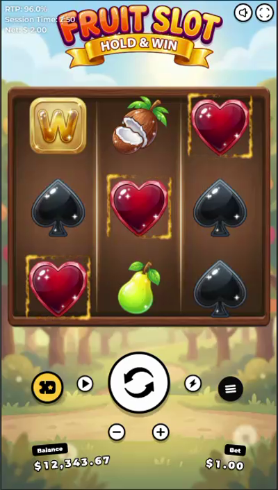

# Fruit Slot — Hold & Win

A 3×3 "Fruit Slot" built on **PixiJS 8**, with spinning reels from
[`pixi-reels`](https://pixi-reels.schmooky.dev/) and the HUD from
[`@open-slot-ui`](https://github.com/schmooky/open-slot-ui).



## Stack

| Piece | Library |
| --- | --- |
| Renderer | `pixi.js` v8 |
| Reels (spin, land, stop) | `pixi-reels` |
| HUD (spin button, balance, bet, autoplay, menu) | `@open-slot-ui/pixi` + `@open-slot-ui/core` |
| Tweening | `gsap` |
| Dev/build | `vite` + TypeScript |

## Develop

```bash
npm install
npm run dev        # http://localhost:5173
npm run build      # typecheck + production build → dist/
npm run typecheck
```

## Layout

```
src/
  config.ts   symbol set, reel geometry, paylines, paytable + win evaluation
  assets.ts   texture/asset loading
  reels.ts    the 3×3 board: pixi-reels reel set, spin(), win frames + payline
  main.ts     app bootstrap, scene layout, HUD mount, spin flow
public/assets/  game art (symbols, backgrounds, logo, frame, jackpots, win FX, audio)
```

## Symbols

`a`=Wild (W) · `b`=grapes · `c`=coconut · `d`=strawberry · `k`=pear · `l`=heart ·
`m`=clover · `n`=spade · `o`=diamond. `v` (gold "C") and `z` (blank money tile)
plus the GRAND/MAJOR/MINOR/MINI jackpots and the win animations are reserved for
the Hold & Win bonus (next phase).

## How the spin works

```ts
const p = reelSet.spin();       // reels start moving
reelSet.setResult(targetGrid);  // tell them what to land on
await p;                        // resolves when landed
```

### Notes for integrators

- **Symbol textures must match `symbolSize`.** pixi-reels renders a recycled
  symbol at its texture's native size (it resets the sprite scale on reuse), so
  the art is 768px and `CELL` is 768 to match — otherwise recycled symbols show
  oversized mid-spin.
- The builder gets `.renderer(app.renderer)` so the spin motion-blur snapshot
  works.

## Status / roadmap

- [x] Project scaffold on the two base libraries
- [x] 3×3 reels spinning and landing on a server-style target grid
- [x] Layout matching the reference (logo · sky · wooden frame · orchard bg · HUD)
- [x] Line evaluation (3 rows + 2 diagonals, wild substitution)
- [x] Win presentation: animated gold frames on winners + traced payline
- [x] Big/Mega/Epic win splash: coin burst + tier text + multiplier count-up
- [x] Winning-symbol pop + dim (spotlight), anticipation tease, line cycling, intro
- [ ] Sound (music `main.mp3` + win SFX; needs a user-gesture to start)
- [ ] Hold & Win bonus: money symbols, respins, GRAND/MAJOR/MINOR/MINI jackpots
- [ ] RGS wiring (real server results, wallet)
